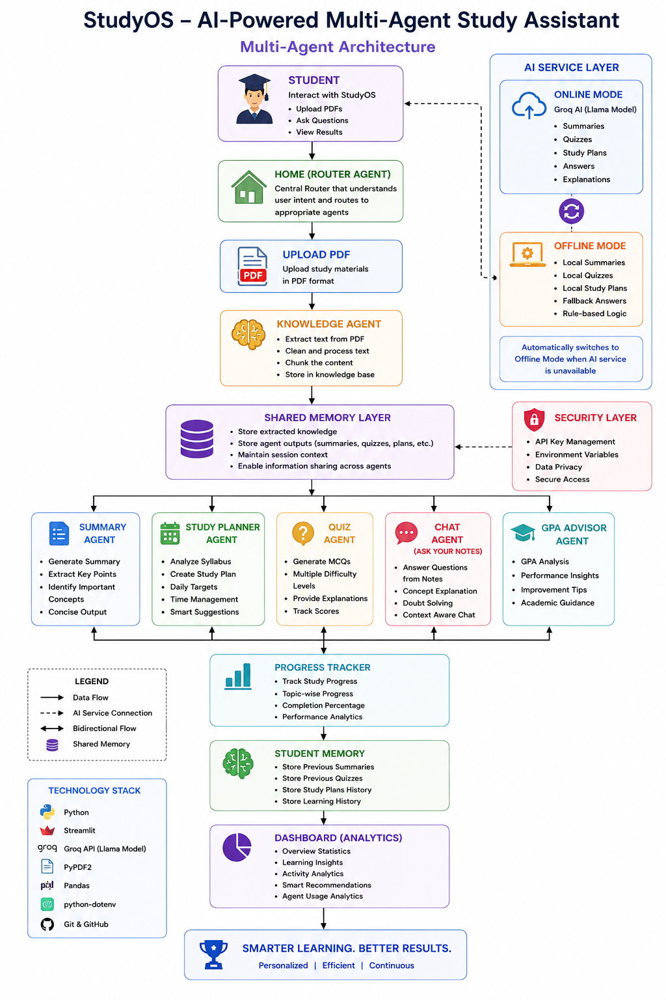

# 📚 StudyOS – AI-Powered Multi-Agent Study Assistant

## 🚀 Overview

StudyOS is an AI-powered Multi-Agent Study Assistant that helps students learn efficiently from PDF notes. The platform automatically extracts content from uploaded study materials and generates AI-powered summaries, quizzes, personalized study plans, and interactive question-answering. It also tracks student progress and stores learning history for future reference.

A key feature of StudyOS is its **dual-mode architecture**, which supports both **Online AI Mode** using the Groq API and **Offline Mode**, allowing the application to continue functioning even when AI services are unavailable.

---

# 🎯 Problem Statement

Students often spend a significant amount of time reading lengthy PDF notes, identifying important concepts, creating revision materials, and preparing for examinations.

Most existing study tools provide only a single feature and depend entirely on internet connectivity or external AI services.

StudyOS solves these challenges by combining multiple intelligent agents into one unified platform that automates the complete learning workflow.

---

# 💡 Solution

StudyOS provides an intelligent learning environment where multiple AI agents collaborate to process uploaded study materials.

The application can:

* Extract text from PDF notes
* Generate concise summaries
* Create multiple-choice quizzes
* Generate personalized study plans
* Answer questions from uploaded notes
* Track learning progress
* Store previous study sessions
* Continue working in Offline Mode when AI services are unavailable

---

# ✨ Features

* 📄 PDF Upload and Text Extraction
* 🤖 AI-Powered Study Summary
* ❓ Automatic Quiz Generation
* 📅 Personalized Study Planner
* 💬 Ask Your Notes (AI Chat)
* 🎓 GPA Advisor
* 📈 Progress Tracker
* 🧠 Student Memory
* 📊 Analytics Dashboard
* 🔒 Secure API Key Management
* 🌐 Online AI Mode (Groq API)
* 💻 Offline Fallback Mode

---

# 🤖 Multi-Agent Architecture

StudyOS follows a Multi-Agent Architecture where specialized agents collaborate to perform different learning tasks.

### Agents

* Router Agent
* Knowledge Agent
* Summary Agent
* Quiz Agent
* Study Planner Agent
* Chat Agent
* GPA Advisor Agent
* Progress Agent
* Memory Manager
* Dashboard Analytics

Each agent performs an independent responsibility while sharing information through a common memory system.

## 🏗️ Architecture Diagram


---

# 🛠️ Technology Stack

## Frontend

* Streamlit

## Backend

* Python

## AI

* Groq API (Llama Model)

## Libraries

* PyPDF2
* python-dotenv
* pandas
* Groq SDK

## Version Control

* Git
* GitHub

---

# 📂 Project Structure

```text
StudyOS
│
├── agents/
├── assets/
├── data/
├── services/
├── skills/
├── utils/
│
├── app.py
├── requirements.txt
├── README.md
├── .gitignore
└── .env
```

---

# ⚙️ Installation

Clone the repository

```bash
git clone https://github.com/ashritha30/StudyOS.git
```

Move into the project folder

```bash
cd StudyOS
```

Install dependencies

```bash
pip install -r requirements.txt
```

Create a `.env` file

```text
GROQ_API_KEY=YOUR_GROQ_API_KEY
```

Run the application

```bash
streamlit run app.py
```

---

# ▶️ Usage

1. Launch the Streamlit application.
2. Upload a PDF document.
3. Generate a study summary.
4. Create a personalized study plan.
5. Ask questions from uploaded notes.
6. Generate quiz questions.
7. Gpa advisor
8. Track learning progress.
9. Review Student Memory and Dashboard.

---

# 🔐 AI Modes

## 🟢 Online Mode

Uses the Groq API to generate AI-powered:

* Summaries
* Quizzes
* Study Plans
* Question Answering

Requires:

* Valid GROQ API Key

---

## 🟡 Offline Mode

Automatically activates if:

* No API key is configured
* Internet is unavailable
* AI service fails

Offline Mode provides:

* Local summaries
* Local quiz generation
* Local study plans

This ensures uninterrupted learning.

---

# 📊 Dashboard

The Dashboard provides:

* Total Summaries
* Total Quizzes
* Study Plans Generated
* Overall Learning Activity
* Agent Usage Analytics
* Smart Study Recommendations

---

# 🧠 Student Memory

StudyOS stores:

* Previous Summaries
* Previous Quizzes
* Previous Study Plans
* Learning History

This enables students to continue their learning sessions without losing progress.

---

# 🔒 Security

* API keys are stored securely using environment variables.
* Sensitive credentials are excluded from GitHub using `.gitignore`.
* No API keys are stored inside the source code.

---

# 🚀 Future Improvements

* Performance Analytics
* Flashcard Generation
* Voice-Based Learning
* Multi-language Support
* Cloud Database Integration
* Collaborative Study Groups
* AI Exam Prediction
* Mobile Application

---

# 📸 Screenshots

Add screenshots here after deployment:

* Home
* Upload PDF
* Summary
* Quiz Generator
* Study Planner
* Ask Your Notes
* Dashboard
* Progress Tracker
* Student Memory

---

# 👩‍💻 Author

**Polamada Naga Ashritha**

B.Tech Computer Science Engineering

Dayananda Sagar University

GitHub: https://github.com/ashritha30

---

# 📜 License

This project is developed for educational and research purposes as part of the Kaggle AI Agents Capstone Project.
